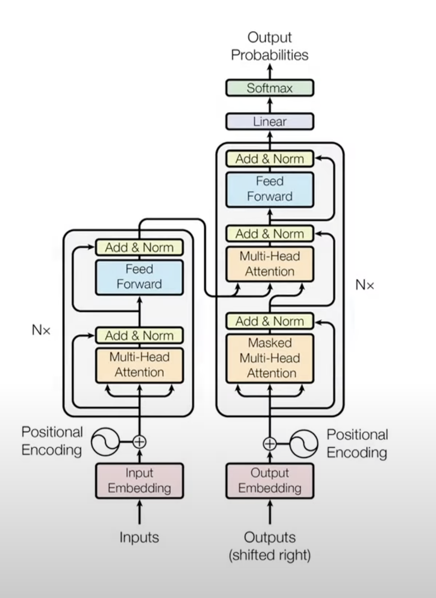
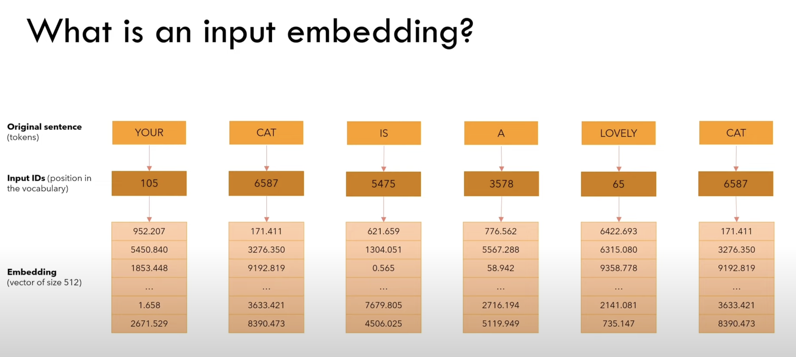
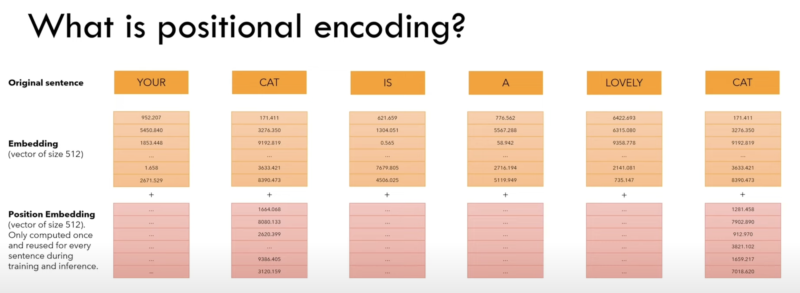
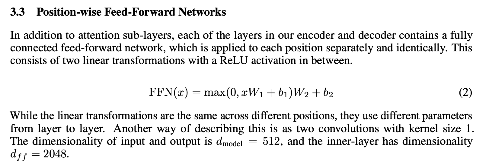
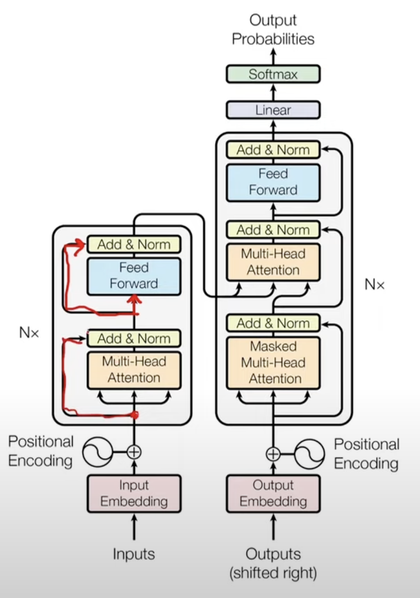
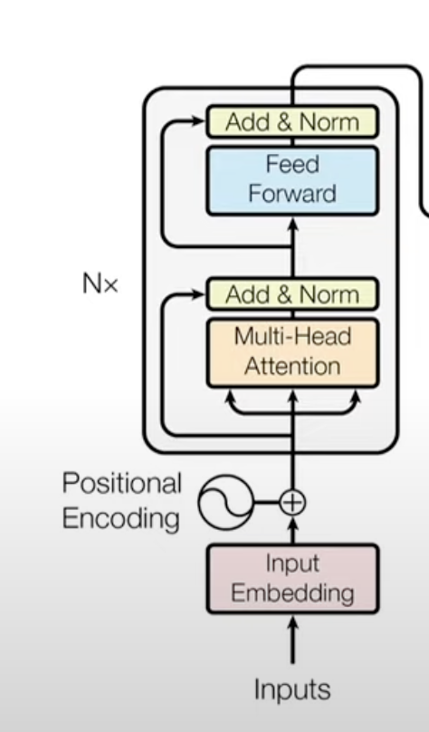
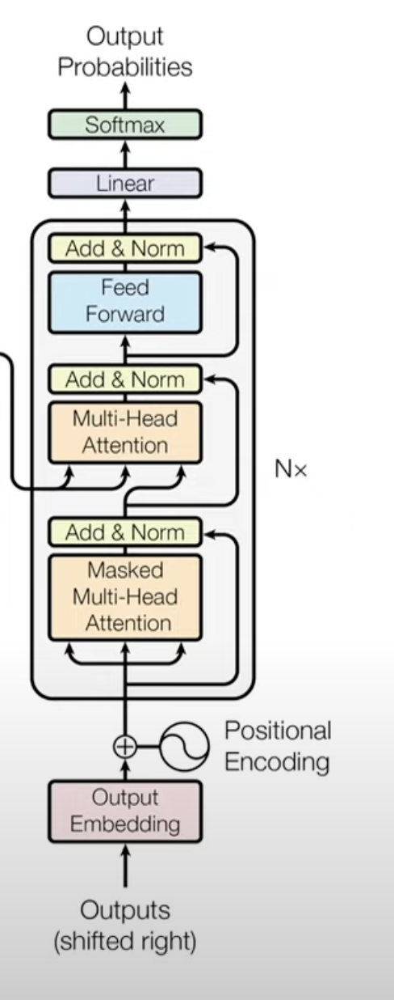

# Flash Attention From First Principles

This repo documents my step-by-step journey of learning and implementing **Flash Attention** from basics to full CUDA/Triton kernels.

## Topics

- Introduction to Multi-Head Attention
- Safe Softmax
- Online Softmax
- Introduction to CUDA \& GPUs
- Tensor Layouts
- Example of CUDA Kernels
- Block Matrix Multiplication
- From CUDA to Triton
- Software Pipelining
- Flash Attention (Forward Pass)
- Autograd
- Derivatives and Gradients
- Gradient of the MatMul operation
- Gradient of the softmax operation
- Flash Attention (Backward Pass)

### Introduction to Multi-Head Attention
Source: [Coding a Transformer from scratch on PyTorch, with full explanation, training and inference.](https://www.youtube.com/watch?v=ISNdQcPhsts)

#### Introduction

#### Input Embeddings

#### Positional Encodings



#### Log Transform in Positional Encoding

- **Math identity:** $ a^b = e^{b \ln(a)} $
- $ 10000^{\frac{2i}{d_{model}}} = e^{\frac{2i}{d_{model}} \ln(10000)} $
- Invert for denominator: $ 10000^{-\frac{2i}{d_{model}}} = e^{-\frac{2i}{d_{model}} \ln(10000)} $
- **Code:**

```python
div_term = torch.exp(torch.arange(0, d_model, 2).float() * (-math.log(10000.0) / d_model))
```

- This matches the scaling in the original formula.

#### Layer Normalization

#### Feed Forward

#### Multi-Head Attention

#### Residual Connection

#### Encoder

#### Decoder

#### Linear Layer
Converts decoder output to vocabulary probabilities.
#### Transformer
#### Task overview
#### Tokenizer
#### Dataset
#### Training loop
#### Validation loop
#### Attention visualization


**Inspired by:**
[Flash Attention from First Principles (YouTube)](https://www.youtube.com/watch?v=zy8ChVd_oTM)
